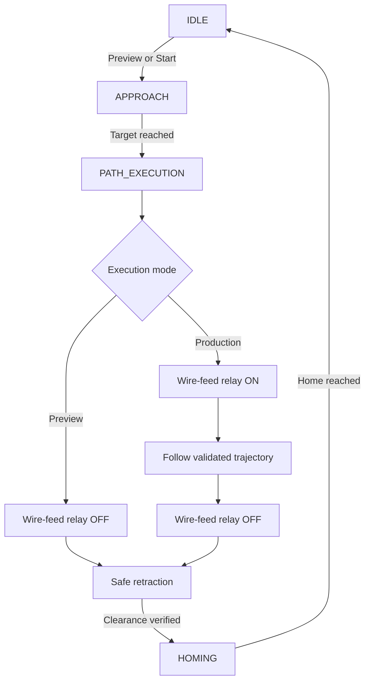
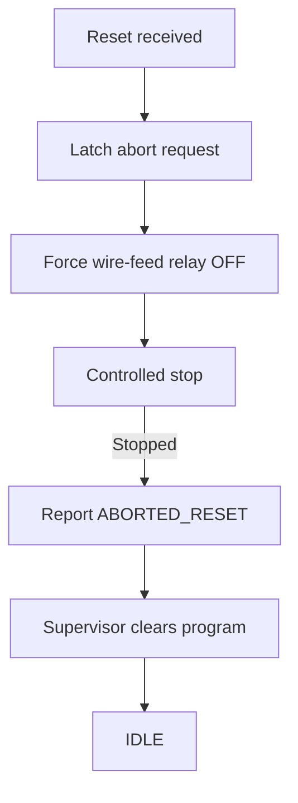
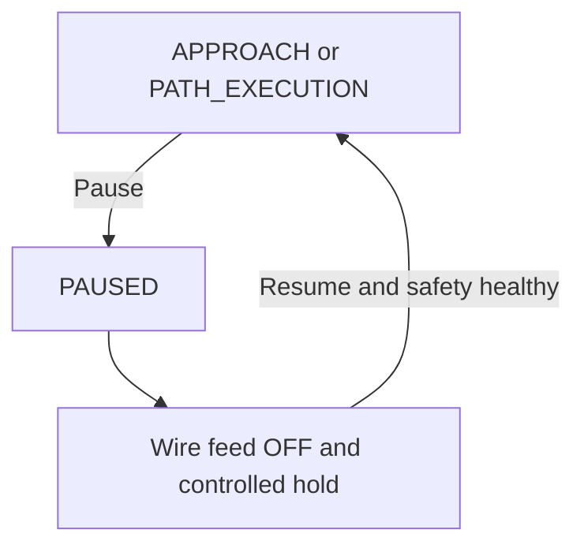
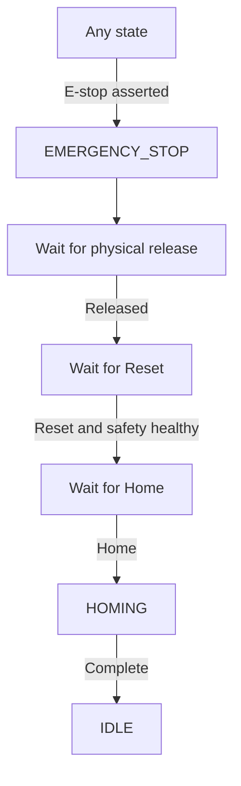

# Runtime State Modules

## Normal Preview and Production sequence

`PATH_EXECUTION` owns trajectory execution, wire-feed relay control, and
retraction. The robot controller does not start the arc and does not wait for
arc feedback; the operator manages the welding station externally.

Preview and Production read the same immutable validated 1 ms artifact.
Preview forces the wire-feed relay off. Production enables the relay before
the first trajectory sample, consumes the same samples, disables the relay
before retraction, and then performs the same retraction.

The relay must also be driven OFF on Pause, Reset, Home abort, state failure,
protective stop, and E-stop. Its de-energized electrical state should represent
wire feed OFF.

## Reset during motion

The program is not cleared until the active state confirms that motion has
stopped. This prevents the 1 ms consumer from reading memory while it is being
invalidated.

## Pause and Resume

The global Supervisor stores the interrupted state. The interrupted module
retains its internal phase and trajectory index. Production resume re-enables
the wire-feed relay before continuing at the retained sample.

## Emergency-stop recovery

Release does not authorize motion. Reset acknowledges the emergency and
clears the volatile active program, but remains in `EMERGENCY_STOP`. Home is a
separate deliberate command that starts recovery motion.

## Migration compatibility

`state_machine_init()` keeps the earlier three-state execution policy so the
existing 362 regression tests and teammate integrations remain reproducible.
The RTOS wrapper calls `state_machine_enable_unified_execution()` and uses the
new `PATH_EXECUTION` policy. The additional policy tests bring the pure
Supervisor suite to 372 checks.

After all branches have migrated, the legacy `ARC_STABILIZING`, `WELDING`, and
`RETRACTING` identifiers and compatibility branches can be removed in a
separate cleanup commit.

## Timing requirement

The current coordinator advances one validated sample per call. Therefore the
active-state runner must execute at the validated artifact period (1 ms). HMI,
logging and storage remain separate, slower tasks. A future split may move the
sample consumer into a dedicated cyclic task while the Supervisor retains only
phase and transition ownership.
